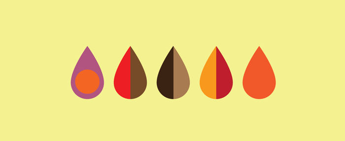

# Seed

A two dots style game where the user must gather many seeds.



Goals:

+ Start with a browser based game using JS (aim to implement without jquery!)
+ Experiment with either a match 3 system or a connect the dots system to collect the seeds
+ Different sizes / layouts of each board
+ Maybe use gsap animation library for more complex animation effects / sequencing
+ A level system where the user progresses either through a hub world (maybe save this for iphone/android implementation later on)

At the moment the build is running using [gulp](http://gulpjs.com/) (just to compile sass but more will likely be added to this)

Make sure you have [gulp](http://gulpjs.com/) (and [node](https://nodejs.org/en/)) installed
globally on your machine

```
$ npm install --global gulp
```

this will let you use the gulp via the command line

Both the artwork and idea specifically are licensed under the Creative Commons Attribution-NonCommercial-ShareAlike 4.0 International Public License
